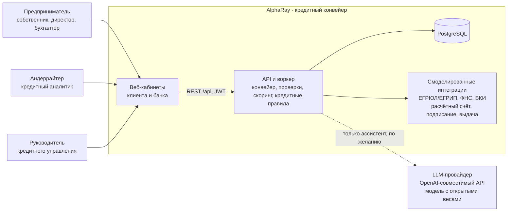
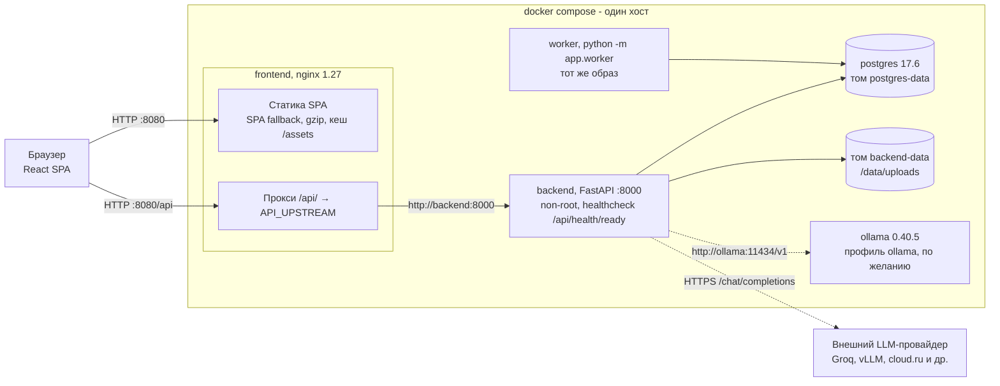
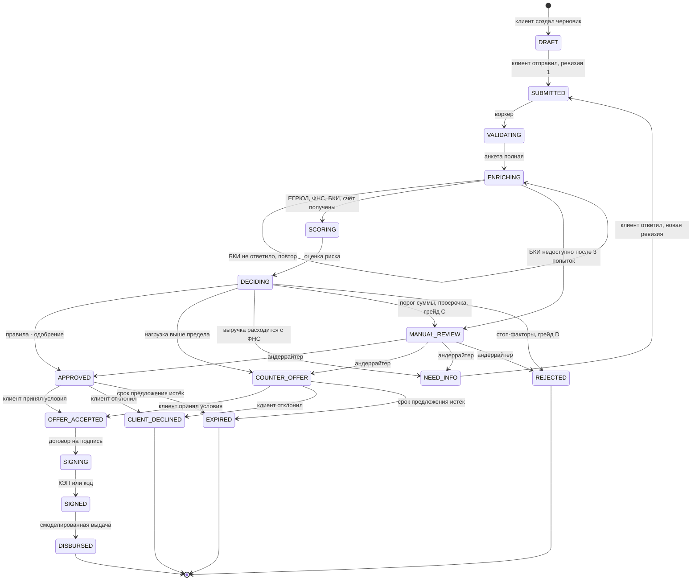
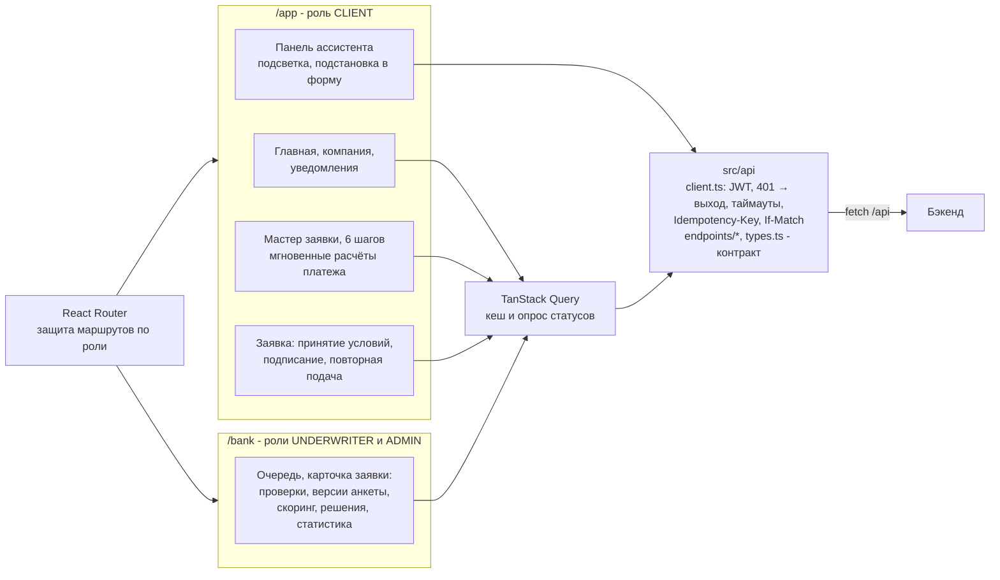
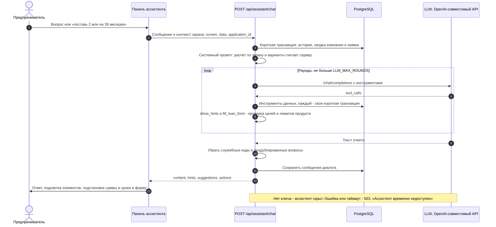
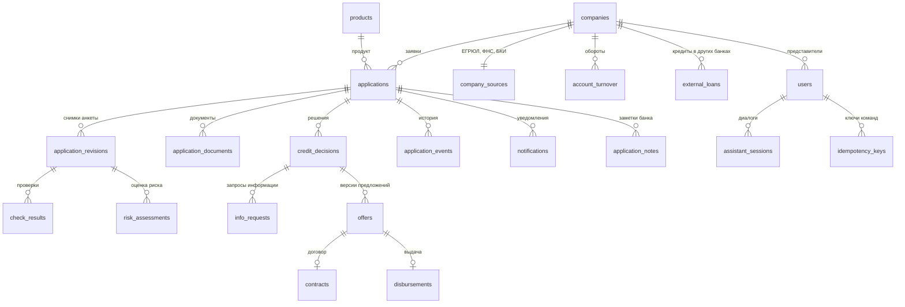

# Архитектура AlphaRay

## 1. Контекст системы

```mermaid
flowchart LR
    client["Предприниматель<br/>собственник, директор, бухгалтер"]
    underwriter["Андеррайтер<br/>кредитный аналитик"]
    head["Руководитель<br/>кредитного управления"]

    subgraph alpharay["AlphaRay - кредитный конвейер"]
        web["Веб-кабинеты<br/>клиента и банка"]
        api["API и воркер<br/>конвейер, проверки, скоринг, кредитные правила"]
        db[("PostgreSQL")]
        mocks["Смоделированные интеграции<br/>ЕГРЮЛ/ЕГРИП, ФНС, БКИ<br/>расчётный счёт, подписание, выдача"]
    end

    llm["LLM-провайдер<br/>OpenAI-совместимый API<br/>модель с открытыми весами"]

    client --> web
    underwriter --> web
    head --> web
    web -->|"REST /api, JWT"| api
    api --> db
    api --> mocks
    api -.->|"только ассистент, по желанию"| llm
```
## 2. Контейнеры

```mermaid
flowchart LR
    browser["Браузер<br/>React SPA"]

    subgraph host["docker compose - один хост"]
        subgraph fe["frontend, nginx 1.27"]
            static["Статика SPA<br/>SPA fallback, gzip, кеш /assets"]
            proxy["Прокси /api/ → API_UPSTREAM"]
        end
        api["backend, FastAPI :8000<br/>non-root, healthcheck /api/health/ready"]
        worker["worker, python -m app.worker<br/>тот же образ"]
        pg[("postgres 17.6<br/>том postgres-data")]
        files[("том backend-data<br/>/data/uploads")]
        ollama["ollama 0.40.5<br/>профиль ollama, по желанию"]
    end

    cloud["Внешний LLM-провайдер<br/>Groq, vLLM, cloud.ru и др."]

    browser -->|"HTTP :8080"| static
    browser -->|"HTTP :8080/api"| proxy
    proxy -->|"http://backend:8000"| api
    api --> pg
    worker --> pg
    api --> files
    api -.->|"HTTPS /chat/completions"| cloud
    api -.->|"http://ollama:11434/v1"| ollama
```
## 3. Бэкенд

```mermaid
flowchart TB
    subgraph http["HTTP-слой, app/routers"]
        direction LR
        r_client["Клиент<br/>auth, config, company<br/>applications, notifications"]
        r_bank["Андеррайтер<br/>bank"]
        r_admin["Руководитель<br/>admin"]
        r_ai["Ассистент<br/>assistant"]
        r_client ~~~ r_bank ~~~ r_admin ~~~ r_ai
    end

    deps["deps.py, idempotency.py, ratelimit.py, logs.py, errors.py<br/>транзакция на запрос, JWT и роли, Idempotency-Key,<br/>лимиты, X-Request-ID, формат ошибок"]

    subgraph domain["Предметная логика"]
        direction LR
        pipeline["pipeline.py<br/>переходы, этапы, предложения,<br/>подписание, выдача"]
        decision["decision.py<br/>кредитные правила, рекомендация"]
        scoring["scoring.py<br/>скоринг, стоп-факторы"]
        integrations["integrations.py<br/>шлюз источников, проверки"]
        insights["insights.py<br/>обороты, нагрузка, лимит"]
        documents["annuity.py, contract.py, signature.py<br/>график, договор, КЭП"]
        pipeline --> decision --> scoring
        pipeline --> integrations
        insights ~~~ documents
    end

    worker["worker.py<br/>FOR UPDATE SKIP LOCKED,<br/>повторы с задержкой"]

    subgraph assistant["app/assistant"]
        direction LR
        agent["agent.py<br/>раунды tool calling"]
        tools["tools.py<br/>инструменты"]
        prompt["prompt.py<br/>контекст и расчёты"]
        llmc["llm.py<br/>OpenAI-совместимый клиент"]
        agent --> tools
        agent --> prompt
        agent --> llmc
    end

    repo["repo.py, models.py, db.py<br/>запросы, ORM SQLAlchemy, типы столбцов"]
    boot["bootstrap.py, seeds.py, migrations/<br/>Alembic, посев, сброс демо"]
    pg[("PostgreSQL")]
    llm["LLM-провайдер"]

    http --> deps
    deps --> domain
    deps --> assistant
    assistant -->|"короткие транзакции"| domain
    worker --> pipeline
    domain --> repo
    boot --> repo
    repo --> pg
    llmc -.-> llm
```
## 4. Статусы заявки

```mermaid
stateDiagram-v2
    [*] --> DRAFT: клиент создал черновик
    DRAFT --> SUBMITTED: клиент отправил, ревизия 1
    SUBMITTED --> VALIDATING: воркер
    VALIDATING --> ENRICHING: анкета полная
    ENRICHING --> ENRICHING: БКИ не ответило, повтор
    ENRICHING --> SCORING: ЕГРЮЛ, ФНС, БКИ, счёт получены
    ENRICHING --> MANUAL_REVIEW: БКИ недоступно после 3 попыток
    SCORING --> DECIDING: оценка риска
    DECIDING --> APPROVED: правила - одобрение
    DECIDING --> COUNTER_OFFER: нагрузка выше предела
    DECIDING --> NEED_INFO: выручка расходится с ФНС
    DECIDING --> MANUAL_REVIEW: порог суммы, просрочка, грейд C
    DECIDING --> REJECTED: стоп-факторы, грейд D
    MANUAL_REVIEW --> APPROVED: андеррайтер
    MANUAL_REVIEW --> COUNTER_OFFER: андеррайтер
    MANUAL_REVIEW --> NEED_INFO: андеррайтер
    MANUAL_REVIEW --> REJECTED: андеррайтер
    NEED_INFO --> SUBMITTED: клиент ответил, новая ревизия
    APPROVED --> OFFER_ACCEPTED: клиент принял условия
    COUNTER_OFFER --> OFFER_ACCEPTED: клиент принял условия
    APPROVED --> CLIENT_DECLINED: клиент отклонил
    COUNTER_OFFER --> CLIENT_DECLINED: клиент отклонил
    APPROVED --> EXPIRED: срок предложения истёк
    COUNTER_OFFER --> EXPIRED: срок предложения истёк
    OFFER_ACCEPTED --> SIGNING: договор на подпись
    SIGNING --> SIGNED: КЭП или код
    SIGNED --> DISBURSED: смоделированная выдача
    DISBURSED --> [*]
    REJECTED --> [*]
    CLIENT_DECLINED --> [*]
    EXPIRED --> [*]
```
## 5. Фронтенд

```mermaid
flowchart LR
    router["React Router<br/>защита маршрутов по роли"]

    subgraph client["/app - роль CLIENT"]
        dash["Главная, компания,<br/>уведомления"]
        wizard["Мастер заявки, 6 шагов<br/>мгновенные расчёты платежа"]
        details["Заявка: принятие условий,<br/>подписание, повторная подача"]
        ray["Панель ассистента<br/>подсветка, подстановка в форму"]
    end

    subgraph bank["/bank - роли UNDERWRITER и ADMIN"]
        queue["Очередь, карточка заявки:<br/>проверки, версии анкеты,<br/>скоринг, решения, статистика"]
    end

    apiLayer["src/api<br/>client.ts: JWT, 401 → выход, таймауты,<br/>Idempotency-Key, If-Match<br/>endpoints/*, types.ts - контракт"]
    query["TanStack Query<br/>кеш и опрос статусов"]

    router --> client
    router --> bank
    dash --> query
    wizard --> query
    details --> query
    ray --> apiLayer
    queue --> query
    query --> apiLayer
    apiLayer -->|"fetch /api"| backend["Бэкенд"]
```
## 6. Путь заявки

```mermaid
sequenceDiagram
    autonumber
    actor C as Предприниматель
    participant FE as Кабинет клиента
    participant API as API
    participant W as Воркер
    participant SRC as Источники (моки)
    actor U as Андеррайтер

    C->>FE: Цель, продукт, сумма и срок, компания, финансы, документы, согласия
    FE->>API: POST /applications, PATCH с If-Match на каждом шаге
    C->>FE: «Отправить заявку»
    FE->>API: POST /applications/:id/submit, Idempotency-Key
    API->>API: Проверка полноты, иначе 422 и список недостающего
    API-->>FE: SUBMITTED, ревизия 1
    loop Каждые 2 с
        W->>W: VALIDATING → ENRICHING → SCORING → DECIDING
        W->>SRC: ЕГРЮЛ, ФНС, счёт, БКИ (повтор при сбое)
        W->>W: Скоринг, затем кредитные правила
    end
    FE->>API: GET /applications/:id - опрос
    alt Авторешение
        API-->>FE: APPROVED, COUNTER_OFFER, NEED_INFO или REJECTED
    else Ручное рассмотрение
        API-->>FE: MANUAL_REVIEW
        U->>API: POST /bank/applications/:id/decision
        API-->>FE: Решение специалиста и уведомление
    end
    opt Нужна информация
        C->>FE: Ответ на запрос банка и документы
        FE->>API: POST /applications/:id/info-requests/:rid/respond
        API->>API: Новая ревизия, повторный прогон конвейера
    end
    C->>FE: «Принять условия»
    FE->>API: POST /offer/accept { offer_id }
    API-->>FE: OFFER_ACCEPTED, договор сформирован
    C->>FE: Подписание КЭП руководителя или кодом с экрана
    FE->>API: POST sign, затем sign/kep или sign/confirm
    API-->>FE: SIGNED
    alt Автовыдача по политике
        W->>W: DISBURSED через 3 с, операция PAY-…
    else Выдача подтверждается банком
        U->>API: POST /bank/applications/:id/disburse
    end
    API-->>FE: DISBURSED, график платежей
```
## 7. Ассистент

```mermaid
sequenceDiagram
    autonumber
    actor C as Предприниматель
    participant P as Панель ассистента
    participant API as POST /api/assistant/chat
    participant DB as PostgreSQL
    participant LLM as LLM, OpenAI-совместимый API

    C->>P: Вопрос или «поставь 2 млн на 36 месяцев»
    P->>API: Сообщение и контекст экрана: screen, data, application_id
    API->>DB: Короткая транзакция: история, сводка компании и заявки
    API->>API: Системный промпт: расчёт по экрану и варианты считает сервер
    loop Раунды, не больше LLM_MAX_ROUNDS
        API->>LLM: /chat/completions с инструментами
        LLM-->>API: tool_calls
        API->>DB: Инструменты данных, каждый - своя короткая транзакция
        API->>API: show_hints и fill_loan_form - проверка целей и лимитов продукта
    end
    LLM-->>API: Текст ответа
    API->>API: Убрать служебные коды и продублированные вопросы
    API->>DB: Сохранить сообщения диалога
    API-->>P: content, hints, suggestions, actions
    P->>C: Ответ, подсветка элементов, подстановка суммы и срока в форму
    Note over API,LLM: Нет ключа - ассистент скрыт. Ошибка или таймаут - 503, «Ассистент временно недоступен»
```
## 8. Данные

```mermaid
erDiagram
    companies ||--o{ users : "представители"
    companies ||--|| company_sources : "ЕГРЮЛ, ФНС, БКИ"
    companies ||--o{ account_turnover : "обороты"
    companies ||--o{ external_loans : "кредиты в других банках"
    companies ||--o{ applications : "заявки"
    products ||--o{ applications : "продукт"
    applications ||--o{ application_revisions : "снимки анкеты"
    applications ||--o{ application_documents : "документы"
    application_revisions ||--o{ check_results : "проверки"
    application_revisions ||--o{ risk_assessments : "оценка риска"
    applications ||--o{ credit_decisions : "решения"
    credit_decisions ||--o{ info_requests : "запросы информации"
    credit_decisions ||--o{ offers : "версии предложений"
    offers ||--o| contracts : "договор"
    offers ||--o| disbursements : "выдача"
    applications ||--o{ application_events : "история"
    applications ||--o{ notifications : "уведомления"
    applications ||--o{ application_notes : "заметки банка"
    users ||--o{ assistant_sessions : "диалоги"
    users ||--o{ idempotency_keys : "ключи команд"
```
